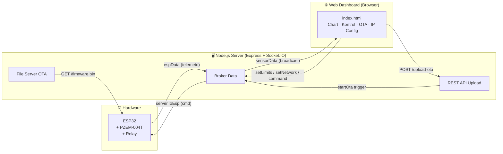
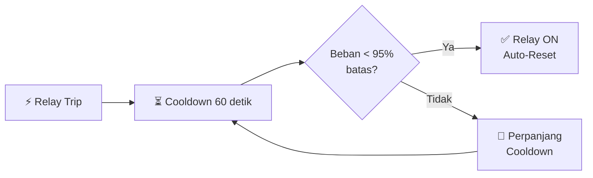

# ⚡ Smart Relay Protection

> Sistem **proteksi beban listrik otomatis** berbasis **ESP32 + PZEM-004T** dengan dashboard monitoring real-time via **Socket.IO**. Server Node.js berperan sebagai broker antara ESP32 dan antarmuka web, dilengkapi fitur **OTA firmware update** dan **konfigurasi jaringan statis** jarak jauh.

---

## 📋 Daftar Isi

- [Fitur Utama](#-fitur-utama)
- [Arsitektur Sistem](#-arsitektur-sistem)
- [Komponen Hardware](#-komponen-hardware)
- [Logika Proteksi](#-logika-proteksi)
- [Struktur Folder](#-struktur-folder)
- [Prasyarat](#-prasyarat)
- [Cara Menjalankan Server](#-cara-menjalankan-server)
- [Konfigurasi Firmware ESP32](#-konfigurasi-firmware-esp32)
- [Dokumentasi Socket Events](#-dokumentasi-socket-events)
- [Dokumentasi REST API](#-dokumentasi-rest-api)
- [Fitur OTA Update](#-fitur-ota-update)
- [Fitur Konfigurasi Jaringan](#-fitur-konfigurasi-jaringan)
- [Dashboard Web](#-dashboard-web)
- [Troubleshooting](#-troubleshooting)
- [Dependensi](#-dependensi)

---

## ✨ Fitur Utama

| Fitur | Keterangan |
| --- | --- |
| ⚡ **Proteksi Tegangan** | Trip instan saat overvoltage (>231V) atau undervoltage (<198V) |
| 🔒 **Proteksi Beban** | Trip saat arus atau daya melebihi batas yang dikonfigurasi |
| 📊 **Filter DSP (EMA)** | Exponential Moving Average meredam *inrush current* adaptor laptop |
| 🔁 **Auto-Reset** | Relay menyala kembali otomatis setelah 60 detik cooldown jika beban aman |
| 📡 **Real-time WebSocket** | Data telemetri dikirim dari ESP32 ke dashboard setiap 300ms |
| 🌐 **OTA Firmware Update** | Upload firmware `.bin` via web dashboard tanpa kabel USB |
| 🔧 **Konfigurasi IP Statis** | Set IP dan gateway ESP32 dari jarak jauh via dashboard |
| 🌗 **Dark / Light Mode** | Dashboard mendukung tema gelap dan terang |
| 🐳 **Docker Ready** | Deploy mudah di CasaOS menggunakan Docker Compose |
| 📶 **WiFiManager** | Konfigurasi WiFi awal melalui Access Point `SmartRelay_AP` |

---

## 🏗️ Arsitektur Sistem



---

## 🔌 Komponen Hardware

| Komponen | Keterangan | Pin ESP32 |
| --- | --- | --- |
| **ESP32** | Mikrokontroler utama | — |
| **PZEM-004T v3.0** | Sensor tegangan, arus, daya, energi, frekuensi, PF | RX: `GPIO16` / TX: `GPIO17` |
| **Relay** | Saklar beban listrik (ON/OFF otomatis) | `GPIO4` |
| **LED Indikator WiFi** | Menyala saat terhubung ke WiFi | `GPIO2` |

### Wiring PZEM-004T → ESP32

```
PZEM-004T       ESP32
---------       -----
TX       ──────► GPIO16 (RX2)
RX       ◄────── GPIO17 (TX2)
GND      ──────── GND
VCC      ──────── 5V
```

---

## 🛡️ Logika Proteksi

### Filter DSP — Exponential Moving Average (EMA)

Mencegah trip palsu akibat *inrush current* menggunakan koefisien `α = 0.15`:

```
filteredI(t) = α × rawI(t) + (1 - α) × filteredI(t-1)
filteredP(t) = α × rawP(t) + (1 - α) × filteredP(t-1)
```

| Parameter | Nilai | Keterangan |
| --- | --- | --- |
| `ALPHA` | `0.15` | Koefisien filter EMA (makin kecil = makin halus) |
| Deadband Arus | `< 0.02 A` → paksa 0 | Eliminasi noise saat beban kosong |
| Deadband Daya | `< 0.5 W` → paksa 0 | Eliminasi noise saat beban kosong |

### Kondisi Trip

| Kondisi | Trigger | Aksi |
| --- | --- | --- |
| **Overvoltage** | `V > 231 V` | Trip instan, masuk mode recovery |
| **Undervoltage** | `198 V > V > 50 V` | Trip instan, masuk mode recovery |
| **Overcurrent** | `rasioArus ≥ 1.05` | Trip, masuk mode recovery |
| **Overpower** | `rasioDaya ≥ 1.05` | Trip, masuk mode recovery |
| **Sensor Gagal** | 5× pembacaan NaN | Trip, tampilkan error sensor |

### Mekanisme Auto-Reset



### Batas Default

| Parameter | Nilai Default |
| --- | --- |
| Batas Arus | `2.0 A` |
| Batas Daya | `440 W` |

> Nilai batas disimpan persisten di **Flash ESP32** menggunakan `Preferences`, tidak hilang saat restart.

---

## 📁 Struktur Folder

```
smart-relay/
├── server.js                   # Server broker (Express + Socket.IO)
├── package.json                # Konfigurasi dependensi Node.js
├── docker-compose.yml          # Konfigurasi Docker untuk CasaOS
├── docker-compose.yml.bak      # Backup konfigurasi Docker
├── Smart_Relay_Protection.ino  # Firmware ESP32 (Arduino)
└── public/
    ├── index.html              # Web dashboard
    └── firmware.bin            # File firmware OTA (hasil upload)
```

---

## 🛠️ Prasyarat

### Server (Node.js)
- **Node.js** versi `18` atau lebih baru
- **npm** (sudah termasuk di instalasi Node.js)

### Docker (Opsional)
- **Docker Engine** `20.10+`
- **Docker Compose** `v2+`

### Firmware ESP32

Install library berikut via **Arduino IDE → Library Manager**:

| Library | Fungsi |
| --- | --- |
| `WiFiManager` | Konfigurasi WiFi via Access Point |
| `PZEM004Tv30` | Driver sensor PZEM-004T |
| `WebSocketsClient` | Koneksi WebSocket ke server |
| `ArduinoJson` | Parsing & serialisasi JSON |
| `HTTPClient` | HTTP request untuk OTA |
| `HTTPUpdate` | Eksekusi update firmware OTA |
| `Preferences` | Penyimpanan persisten di Flash |

---

## 🚀 Cara Menjalankan Server

### Metode 1 — Node.js Langsung

```bash
# Install dependensi
npm install

# Jalankan server
node server.js
```

Server berjalan di **`http://localhost:3000`**

---

### Metode 2 — Docker Compose (Rekomendasi untuk CasaOS)

```bash
# Jalankan container di background
docker compose up -d

# Cek status
docker compose ps

# Lihat log real-time
docker compose logs -f

# Hentikan container
docker compose down
```

> **Port:** `http://localhost:3000` atau `http://<IP-SERVER>:3000`

> **Volume:** Semua file proyek di-mount dari `/DATA/AppData/smart-relay` ke `/app` di dalam container, sehingga file `firmware.bin` yang di-upload tersimpan persisten.

---

## ⚙️ Konfigurasi Firmware ESP32

Edit baris berikut di awal `Smart_Relay_Protection.ino` sebelum di-upload:

```cpp
// Alamat domain/IP server Node.js
const char* ws_host = "smart-relay.ijuloss.my.id";

// Port server
const int ws_port = 443;

// Gunakan SSL? (true = WSS/HTTPS, false = WS/HTTP)
const bool use_ssl = true;
```

### Alur Konfigurasi WiFi Pertama Kali

1. Upload firmware ke ESP32
2. ESP32 membuat Access Point bernama **`SmartRelay_AP`**
3. Hubungkan HP/laptop ke WiFi `SmartRelay_AP`
4. Buka browser → `http://192.168.4.1`
5. Pilih jaringan WiFi dan masukkan password
6. ESP32 restart dan terhubung ke WiFi
7. **LED GPIO2 menyala** → koneksi berhasil ✅

---

## 📡 Dokumentasi Socket Events

Server berperan sebagai **broker** yang meneruskan pesan antara ESP32 dan browser.

### ESP32 → Server → Browser

| Event | Keterangan |
| --- | --- |
| `espData` | Data telemetri real-time dari ESP32 |

**Contoh payload `espData`:**

```json
{
  "v": 220.5,
  "i": 1.23,
  "p": 270.6,
  "e": 0.185,
  "f": 50.0,
  "pf": 0.98,
  "relay": "ON",
  "alasan": "Kondisi Ideal",
  "rI": 0.615,
  "fzI": "Normal",
  "rP": 0.615,
  "fzP": "Normal",
  "fzV": "Normal",
  "recovery": false
}
```

| Field | Tipe | Keterangan |
| --- | --- | --- |
| `v` | Float | Tegangan (Volt) |
| `i` | Float | Arus terfilter EMA (Ampere) |
| `p` | Float | Daya terfilter EMA (Watt) |
| `e` | Float | Energi akumulasi (kWh) |
| `f` | Float | Frekuensi (Hz) |
| `pf` | Float | Power Factor |
| `relay` | String | Status relay: `"ON"` / `"OFF"` |
| `alasan` | String | Keterangan kondisi sistem |
| `rI` | Float | Rasio arus (I ÷ batasArus) |
| `fzI` | String | `"Normal"` / `"Overload"` |
| `rP` | Float | Rasio daya (P ÷ batasDaya) |
| `fzP` | String | `"Normal"` / `"Overpower"` |
| `fzV` | String | `"Normal"` / `"Overvoltage"` / `"Undervoltage"` |
| `recovery` | Boolean | `true` jika dalam mode cooldown |

---

### Browser → Server → ESP32

| Event | Payload | Keterangan |
| --- | --- | --- |
| `setLimits` | `{ i: float, p: float }` | Update batas arus dan daya |
| `setNetwork` | `{ ip: string, gw: string }` | Set IP statis ESP32 |
| `command` | String | Perintah langsung ke ESP32 |

**Daftar nilai `command`:**

| Perintah | Fungsi |
| --- | --- |
| `resetRecovery` | Paksa reset mode cooldown, relay ON |
| `resetKwh` | Reset akumulasi energi (kWh) ke 0 |
| `startOta` | Perintah ESP32 unduh & pasang firmware |
| `resetWifi` | Hapus konfigurasi WiFi, buat ulang AP |

---

### Server → Browser (Sinkronisasi)

| Event | Payload | Keterangan |
| --- | --- | --- |
| `sensorData` | Objek telemetri | Broadcast data sensor ke semua browser |
| `updateLimits` | `{ i: float, p: float }` | Sinkronisasi limit ke semua tab |

---

## 📡 Dokumentasi REST API

### `POST /upload-ota`

Upload file firmware `.bin` untuk OTA ke ESP32.

- **Request:** `multipart/form-data`, field: `firmware` (file `.bin`)
- **Response:** `Deploy sukses! ESP32 sedang menarik firmware...`

```bash
# Contoh menggunakan curl
curl -X POST http://localhost:3000/upload-ota \
  -F "firmware=@/path/ke/firmware.bin"
```

> Setelah upload, server otomatis mengirim event `startOta` ke ESP32.

---

### Static Files

| URL | Keterangan |
| --- | --- |
| `http://localhost:3000/` | Web Dashboard |
| `http://localhost:3000/firmware.bin` | File firmware untuk OTA |
| `http://localhost:3000/socket.io/socket.io.js` | Library Socket.IO client |

---

## 🔄 Fitur OTA Update

1. Compile sketch Arduino → **Sketch → Export Compiled Binary** (`.bin`)
2. Buka dashboard web di browser
3. Pilih file `.bin` di panel **OTA Upload**
4. Klik **Deploy Firmware**
5. Server simpan file ke `public/firmware.bin` dan kirim sinyal ke ESP32
6. ESP32 unduh firmware dari `https://<ws_host>/firmware.bin`
7. ESP32 update dan restart otomatis ✅

> ⚠️ Partisi flash ESP32 minimal **4MB** diperlukan untuk mendukung OTA.

---

## 🌐 Fitur Konfigurasi Jaringan

1. Buka panel **Konfigurasi Jaringan** di dashboard
2. Isi **IP Statis** (contoh: `192.168.1.100`)
3. Isi **IP Gateway** (contoh: `192.168.1.1`)
4. Klik **Simpan & Restart**
5. ESP32 simpan konfigurasi ke Flash lalu restart ✅

> Konfigurasi tersimpan persisten — tidak hilang meski ESP32 mati atau restart.

---

## 🖥️ Dashboard Web

Akses melalui browser:

| Akses | URL |
| --- | --- |
| Lokal | `http://localhost:3000` |
| Jaringan | `http://<IP-SERVER>:3000` |
| Domain | `https://smart-relay.ijuloss.my.id` |

**Fitur yang tersedia:**

| Panel | Fungsi |
| --- | --- |
| **Status Koneksi** | Indikator koneksi WebSocket ke server dan ESP32 |
| **Telemetri Utama** | Tegangan, Arus, Daya, Energi, Frekuensi, PF |
| **Status Relay** | Status ON/OFF dan keterangan kondisi sistem |
| **Rasio Beban** | Progress bar rasio arus & daya terhadap batas |
| **Himpunan Status** | Label: Normal / Overload / Overvoltage / dll |
| **Chart Real-time** | Grafik arus dan daya live |
| **Set Batas** | Input ubah batas arus (A) dan daya (W) |
| **Kontrol Relay** | Reset Recovery, Reset kWh, Reset WiFi |
| **OTA Upload** | Upload firmware `.bin` dan trigger update |
| **Konfigurasi IP** | Set IP statis dan gateway ESP32 |
| **Dark / Light Mode** | Toggle tema tampilan |

---

## 🔧 Troubleshooting

| Masalah | Kemungkinan Penyebab | Solusi |
| --- | --- | --- |
| ESP32 tidak konek ke server | URL WebSocket salah / server mati | Cek `ws_host` dan `ws_port` di firmware |
| Dashboard tidak terima data | ESP32 offline / socket belum ready | Lihat log server; tunggu `socketIoReady = true` |
| Relay trip terus (false trip) | Inrush current tinggi | Kecilkan nilai `ALPHA` pada filter EMA |
| OTA gagal | File `.bin` salah / server tidak terjangkau | Pastikan server dapat diakses dari ESP32 |
| LED WiFi tidak menyala | Gagal konek WiFi | Jalankan `resetWifi` dari dashboard, atur ulang WiFi |
| Nilai sensor selalu NaN | PZEM tidak terhubung / wiring salah | Periksa koneksi TX/RX dan catu daya PZEM |
| Container Docker restart loop | Port 3000 sudah dipakai proses lain | Ganti port host di `docker-compose.yml` |
| IP statis tidak berfungsi | Gateway tidak satu subnet | Pastikan gateway dan IP dalam subnet yang sama |

---

## 📦 Dependensi

### Server (Node.js)

| Package | Versi | Fungsi |
| --- | --- | --- |
| [express](https://expressjs.com/) | `^4.18.2` | HTTP server, routing, static file serving |
| [socket.io](https://socket.io/) | `^4.7.2` | WebSocket broker real-time |
| [multer](https://github.com/expressjs/multer) | `^1.4.5-lts.1` | Upload file firmware (OTA) |

### Dashboard (CDN)

| Library | Fungsi |
| --- | --- |
| [Socket.IO Client](https://socket.io/) | Koneksi WebSocket dari browser |
| [Chart.js](https://www.chartjs.org/) | Grafik real-time arus dan daya |
| [Plus Jakarta Sans](https://fonts.google.com/specimen/Plus+Jakarta+Sans) | Tipografi utama dashboard |
| [JetBrains Mono](https://fonts.google.com/specimen/JetBrains+Mono) | Font monospace untuk nilai numerik |

---

## 📝 Lisensi

Proyek ini dibuat untuk keperluan penelitian dan pengembangan sistem proteksi beban listrik cerdas berbasis IoT. Bebas digunakan dan dimodifikasi untuk keperluan pendidikan dan riset.

---

<div align="center">
  <sub>ESP32 · PZEM-004T · Node.js · Socket.IO · Docker</sub>
</div>
